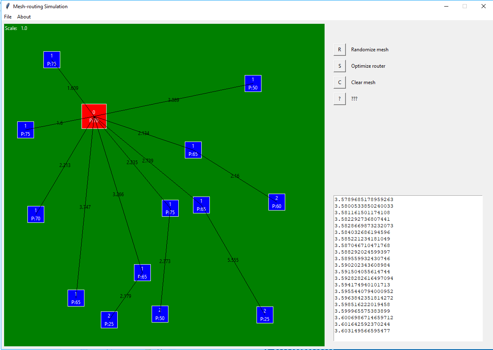

# mesh-routing

Mesh network simulator and mesh optimization tool.

Allows for the placement of nodes (parent and child nodes) in a mesh network, calculating the optimal path between the parent nodes and all children,

Uses ETX (Expected transmission Count) as objective function, and Djikstra algorithm for optimizing the graph.

Router position optimization is done with coarse grid search followed by a fine tuning using gradiente descent.

